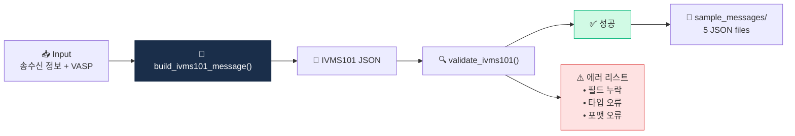

# Project 01 — IVMS101 메시지 빌더 + 검증

> Travel Rule 메시지 표준을 손으로 만들면서 체화. (D28 미니 프로젝트)

## 🏗 아키텍처



## 왜 이걸 만드나

Travel Rule 이론을 여러 문서로 읽어도 **실제 IVMS101 메시지가 어떻게 생겼는지** 한 번도 만져보지 않으면 이해가 겉핥기로 남습니다. 이 프로젝트는 **한국 100만원 시나리오**를 중심으로 Originator·Beneficiary·VASP 정보를 JSON으로 직접 생성하고 검증합니다. 필수 필드·타입·길이 제약을 손으로 처리해보면 **D22·D23에서 배운 내용**이 정확히 어디에 쓰이는지 몸에 새겨집니다.

## 학습 목표

1. IVMS101 JSON 스키마 구조 이해
2. 필수 vs 선택 필드 구분
3. 한국 100만원 시나리오 메시지 생성
4. 기본 검증 (필드 누락, 타입 오류) 함수

## 사양

### 입력
- 송신인 정보 (이름, 주소, 지갑주소, DOB)
- 수신인 정보 (이름, 지갑주소)
- VASP 정보 (송수신측 LEI 또는 ID)
- 금액, 자산 종류

### 출력
- IVMS101 호환 JSON
- 검증 결과 (성공/실패 + 에러 리스트)

## 인터페이스

```python
def build_ivms101_message(
    originator: dict,
    beneficiary: dict,
    originating_vasp: dict,
    beneficiary_vasp: dict,
    amount: float,
    asset: str,
) -> dict:
    """IVMS101 호환 JSON 빌드"""

def validate_ivms101(msg: dict) -> tuple[bool, list[str]]:
    """필수 필드 + 타입 검증"""
```

## 테스트 케이스

1. **정상 한국 100만원** — 필드 모두 채움
2. **송신인 이름 누락** — 검증 실패
3. **잘못된 wallet 형식** — 0x...가 아닌 ETH 주소
4. **비표준 통화 코드** — "BTCC" 같은 오타
5. **EU TFR 호환** — 200만원, 임계 없는 EU 시나리오

## 산출물

```
01_ivms101_builder/
├── README.md (이 파일)
├── main.py
├── test.py
├── requirements.txt
├── sample_messages/
│   ├── 01_korea_normal.json
│   ├── 02_originator_missing.json
│   ├── 03_invalid_wallet.json
│   ├── 04_invalid_currency.json
│   └── 05_eu_tfr.json
└── .env.example  # 사용 안 함, 빈 파일
```

## IVMS101 핵심 스키마 (빌더가 반드시 다뤄야 할 경로)

```
originator
 └─ originatorPersons[]
     └─ naturalPerson  (또는 legalPerson — 택일 discriminator)
         ├─ name
         │   └─ nameIdentifier[]
         │       ├─ primaryIdentifier      (성)
         │       ├─ secondaryIdentifier    (이름)
         │       └─ nameIdentifierType     (LEGL / BIRT / ALIA ...)
         ├─ geographicAddress[]
         │   ├─ addressType                (HOME / BIZZ ...)
         │   ├─ country                    (ISO 3166-1 alpha-2)
         │   └─ addressLine[]              (또는 streetName + buildingNumber)
         ├─ nationalIdentification
         │   ├─ nationalIdentifier
         │   ├─ nationalIdentifierType     (ARNU / DRLC / PASS ...)
         │   └─ countryOfIssue
         ├─ dateAndPlaceOfBirth
         │   ├─ dateOfBirth                (YYYY-MM-DD)
         │   ├─ placeOfBirth
         │   └─ countryOfBirth
         └─ countryOfResidence
 └─ accountNumber[]                         (보통 지갑주소)

beneficiary: originator와 동일 구조 (최소 필드는 완화 가능)

originatingVASP  / beneficiaryVASP
 └─ legalPerson
     ├─ name.nameIdentifier (LEGL)
     ├─ nationalIdentification  (LEI 권장, countryOfIssue 필수)
     └─ geographicAddress
```

### 검증 수준 (validate_ivms101이 잡아야 할 것)
1. **Discriminator**: `naturalPerson` XOR `legalPerson` (둘 다 있거나 없으면 오류)
2. **필수 필드**: `primaryIdentifier`, `country`(ISO-2), `accountNumber`, VASP `name` 존재
3. **포맷**: `dateOfBirth` ISO 8601, `country` ISO 3166-1 alpha-2, LEI 20자 영숫자
4. **문자열 길이**: IVMS101은 대부분 길이 제한 있음 (이름 100자, 주소 필드 35자 등)

JSON Schema로 검증하려면 `jsonschema` 라이브러리 + [공식 IVMS101 스키마 JSON 파일](https://intervasp.org) 또는 Notabene 샘플 스키마를 내려받아 사용.

## 💼 실무 현장 (Industry Reality)

### 실제 회사에서는 이 기능을 어떻게 쓰나

한국 VASP에서 Travel Rule 메시지 발신은 **출금 워크플로의 일부**입니다. 사용자가 100만원 이상 외부 지갑으로 출금 요청 → 해당 지갑이 **카운터파티 VASP**인지 판정(지갑 라벨 DB 조회) → 맞으면 IVMS101 메시지 생성·송신 → 카운터파티 응답 수신(수취인 이름 일치 여부 확인) → 응답 OK면 온체인 전송, NG면 **"Travel Rule 미이행 출금 거절"**. 이 플로우 전체가 **수 초 내** 끝나야 UX가 유지되므로, 실제로는 IVMS101 메시지를 **pre-built 템플릿 + 필드 채우기**로 운영합니다.

### 프로덕션 아키텍처 비교

| 항목 | 학습용(이 프로젝트) | 실제 프로덕션 |
|---|---|---|
| 메시지 생성 | Python dict → JSON | IVMS101 공식 스키마 + JSON Schema validator |
| 전송 | 파일 생성에서 끝 | TLS 1.3 + 상호 인증서(mTLS) + 서명 |
| 카운터파티 식별 | 수동 입력 | VASP Directory(Notabene·TRISA 디렉터리) 조회 |
| PII 보호 | 평문 JSON | 엔드투엔드 암호화(AES-GCM) + 키 회전 |
| 감사 로그 | 없음 | 모든 메시지 송수신 5~15년 보관 |
| 프로토콜 | JSON 파일 | TRP(21 Analytics) · TRISA(gRPC) · IVMS101+ 벤더 자체 |

### 벤더 대체재

- **Notabene** — 글로벌 점유율 1위 추정, REST API + SDK, 라이선스 약 연 $50K~$200K 구간(VASP 규모별)
- **VerifyVASP (람다256)** — 한국 Upbit·두나무 계열. 국내 VASP 간 상호접속 가장 넓음. Chainalysis KYT와 bundled 제공
- **CODE** — Bithumb·Coinone·Korbit 중심 한국 표준 지향. 한국 VASP 연합이 주주
- **TRISA** — 오픈소스·중립. 인증서 기반 상호 검증, 회비만 있으면 사용
- **21 Analytics (TRP)** — 스위스 기반 유럽 은행권 영향. Travel Rule Protocol 표준 주도

2026년 기준 한국 VASP 대부분은 **VerifyVASP 또는 CODE** 중 하나 + 해외 카운터파티용 Notabene 병행이 흔함.

### 운영 KPI·SLA

- **송신 성공률**: ≥ 99% (네트워크·카운터파티 응답 실패 제외)
- **메시지 round-trip 지연**: p95 < 5초 (UX 블로킹 한계)
- **수취인 이름 일치율**: 70~85% (한국어 로마자 표기 차이로 FP 다발)
- **필드 누락 거절율**: 외교부·FIU 권고상 1~2% 이하
- **카운터파티 커버리지**: 글로벌 상위 50 VASP 중 몇 개와 연결되어 있는가 (영업 협상 지표)

### 배포·운영 팁

- **본인확인기관 데이터 재사용**: PASS·NICE 실명확인 결과에서 IVMS101의 `naturalPerson` 필드를 자동 채우면 FP 감소. 단 **동의 범위**에 Travel Rule 사용이 포함됐는지 법무 검토 필수.
- **한국어 이름 로마자 표기**: 성 "이"를 Lee·Yi·Rhee 중 어떤 것으로 송신하는가로 수취인 일치율이 10~20%p 요동. 사내 표기 규칙(여권 MRZ 기준 권장) 고정이 필요.
- **비수취 VASP(sunrise issue)**: 카운터파티가 Travel Rule 미도입 국가이면 규제상 "선량한 조치" 로그 남기고 결정. 2024년부터 FATF가 "비수취 VASP로의 송금 금지"까지는 요구 안 함.
- **private wallet(셀프 커스터디)**: EU TFR은 1,000유로 초과 시 수신 지갑 주소에 대한 **자체 검증** 의무. 한국은 2026 현재 요구 없음이나 향후 도입 가능성.

## 학습 자료

- [`../../notes/4-technology/travel-rule-protocols.md`](../../notes/4-technology/travel-rule-protocols.md) — IVMS101 deep
- [`../../notes/3-crypto-aml/travel-rule.md`](../../notes/3-crypto-aml/travel-rule.md) — Travel Rule 운영
- [Notabene IVMS101 분석](https://notabene.id/travel-rule-messaging-protocols/ivms-101)
- [VerifyVASP IVMS101 docs](https://www.verifyvasp.com/)

## 한계 / 주의

- **이 코드는 학습용**. 실제 Travel Rule 운영에는 인증서 + 전송 프로토콜 + 카운터파티 식별 등이 더 필요
- IVMS101 정식 스키마는 InterVASP에서 라이센스 (이 프로젝트는 단순화 버전)
- 프로덕션 환경에서는 Notabene/VerifyVASP/CODE 같은 검증된 솔루션 사용

## 보너스 챌린지

- IVMS101 → ISO 20022 메시지 변환 (전통 금융 호환)
- 카운터파티 VASP Discovery (Mock)
- PII 암호화 (송신 전)
