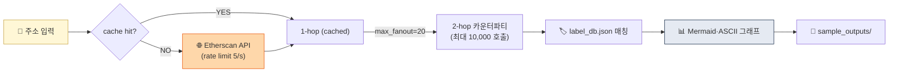

# Project 02 — Etherscan API 2-hop Tracer

> 직접 온체인 데이터로 자금 흐름 분석. (D35 미니 프로젝트)

## 🏗 아키텍처



## 왜 이걸 만드나

Chainalysis·TRM 같은 벤더의 UI로 이미 분석된 결과만 보다가 **직접 Etherscan API를 쳐서 트랜잭션을 긁어오는 경험**을 하면, KYT 벤더들이 해결하는 문제(속도·fan-out 폭발·rate limit·라벨링)를 몸으로 느낍니다. 1-hop은 간단하지만 2-hop부터 **요청 수가 10,000회까지 폭발**하는 현실이 벤더 가치를 체감시키는 순간. Week 5에서 배운 **Clustering·Attribution·Exposure**가 실무에서 어떻게 제약되는지의 교훈.

## 학습 목표

1. Etherscan API 사용 (무료 티어)
2. 1-hop / 2-hop 카운터파티 추출
3. 라벨 매칭 시도
4. 결과 시각화 (ASCII / Mermaid)

## 사양

### 입력
- Ethereum 주소 1개

### 출력
- 1-hop: 직접 거래 카운터파티 (이름/금액/시점)
- 2-hop: 1-hop 주소들의 추가 카운터파티
- 텍스트 그래프 또는 Mermaid 다이어그램

## 인터페이스

```python
def get_normal_txs(address: str, limit: int = 100) -> list[dict]:
    """주소의 normal transactions"""

def trace_one_hop(address: str) -> dict[str, dict]:
    """{counterparty: {tx_count, total_amount, last_tx}}"""

def trace_two_hop(address: str) -> dict[str, dict[str, dict]]:
    """{1-hop: {2-hop: {...}}}"""

def render_mermaid(graph: dict) -> str:
    """Mermaid 다이어그램 생성"""
```

## 테스트 주소 추천

공개로 알려진 주소 (학습용):
- Vitalik Buterin (0xd8dA6BF26964aF9D7eEd9e03E53415D37aA96045)
- Binance Hot Wallet (0x28C6c06298d514Db089934071355E5743bf21d60)
- Tornado Cash 1 ETH 풀 (0x12D66f87A04A9E220743712cE6d9bB1B5616B8Fc)

## 산출물

```
02_onchain_tracer/
├── README.md
├── main.py
├── requirements.txt
├── data/
│   └── label_db.json  # 자체 라벨 DB
├── sample_outputs/
│   ├── trace_vitalik.md
│   └── trace_tornado.md
└── .env.example
```

## .env

```
ETHERSCAN_API_KEY=your_free_key  # https://etherscan.io/apis
```

## 학습 자료

- [`../../notes/4-technology/blockchain-analytics.md`](../../notes/4-technology/blockchain-analytics.md) — Clustering + Attribution
- [Etherscan API 문서](https://docs.etherscan.io/)

## 한계 / 주의

- Etherscan 무료 티어: 5 calls/sec, 100,000/day
- **Fan-out 폭발 주의**: 1 ETH 주소 → 100개 거래 → 100명 카운터파티 → 2-hop 시 **최대 10,000회 호출**. 무보호 구현은 수 분 내 일일 한도 소진.
- **필수 가드** (구현에 반영):
  - `CACHE_DIR` 로컬 JSON 캐시 (같은 주소 재조회 금지)
  - `MAX_FANOUT` 상한 (예: 1-hop 20명, 2-hop 각각 10명으로 잘라내기)
  - `time.sleep(0.25)` 또는 token-bucket 레이트 리미터 (5 req/sec 보수적 운영)
  - `tenacity` 기반 지수 백오프 (429/503 재시도)
  - 작은 카운터파티(예: < 0.01 ETH)는 프루닝
- ERC-20 token transfers는 별도 API endpoint (이 버전은 normal tx만)
- 한국 거래소 attribution은 한정적

## 보너스 챌린지

- ERC-20 token transfers 추가
- Risk Score 계산 (mixer/SDN exposure)
- Multi-chain (BSC, Polygon 추가)
- Visualization (graphviz, vis.js)
