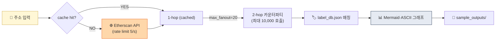

# Project 02 — Etherscan API 2-hop Tracer

> 직접 온체인 데이터로 자금 흐름 분석. (D35 미니 프로젝트)


> **상태**: 스펙 작성 완료 (README.md만 존재, `main.py` 미작성 — 학습자 구현 대상)
> **위치**: `projects/02-onchain-tracer/` (예정: README.md + main.py + test.py + sample_outputs/)
> **예상 구현 시간**: 주말 2일

## 🏗 아키텍처



## 왜 이걸 만드나

Chainalysis·TRM 같은 벤더의 UI로 이미 분석된 결과만 보다가 **직접 Etherscan API를 쳐서 트랜잭션을 긁어오는 경험**을 하면, KYT 벤더들이 해결하는 문제(속도·fan-out 폭발·rate limit·라벨링)를 몸으로 느낍니다. 1-hop은 간단하지만 2-hop부터 **요청 수가 10,000회까지 폭발**하는 현실이 벤더 가치를 체감시키는 순간. Week 5에서 배운 **Clustering·Attribution·Exposure**가 실무에서 어떻게 제약되는지의 교훈.

## 학습 목표

1. Etherscan API 사용 (무료 티어)
2. 1-hop / 2-hop 카운터파티 추출
3. 라벨 매칭 시도
4. 결과 시각화 (ASCII / Mermaid)

## 사양

### 입력
- Ethereum 주소 1개

### 출력
- 1-hop: 직접 거래 카운터파티 (이름/금액/시점)
- 2-hop: 1-hop 주소들의 추가 카운터파티
- 텍스트 그래프 또는 Mermaid 다이어그램

## 인터페이스

```python
def get_normal_txs(address: str, limit: int = 100) -> list[dict]:
    """주소의 normal transactions"""

def trace_one_hop(address: str) -> dict[str, dict]:
    """{counterparty: {tx_count, total_amount, last_tx}}"""

def trace_two_hop(address: str) -> dict[str, dict[str, dict]]:
    """{1-hop: {2-hop: {...}}}"""

def render_mermaid(graph: dict) -> str:
    """Mermaid 다이어그램 생성"""
```

## 테스트 주소 추천

공개로 알려진 주소 (학습용):
- Vitalik Buterin (0xd8dA6BF26964aF9D7eEd9e03E53415D37aA96045)
- Binance Hot Wallet (0x28C6c06298d514Db089934071355E5743bf21d60)
- Tornado Cash 1 ETH 풀 (0x12D66f87A04A9E220743712cE6d9bB1B5616B8Fc)

## 산출물

```
02_onchain_tracer/
├── README.md
├── main.py
├── requirements.txt
├── data/
│   └── label_db.json  # 자체 라벨 DB
├── sample_outputs/
│   ├── trace_vitalik.md
│   └── trace_tornado.md
└── .env.example
```

## .env

```
ETHERSCAN_API_KEY=your_free_key  # https://etherscan.io/apis
```

## 💼 실무 현장 (Industry Reality)

### 실제 회사에서는 이 기능을 어떻게 쓰나

Onchain Tracer는 AML 조직에서 **Investigation(수사)팀·FCI(Financial Crimes Investigations)팀**의 일상 도구입니다. STR 초안 작성 전 "이 지갑의 자금이 어디서 왔나·어디로 갔나"를 **2~6 hop 추적**해 서사로 구성하는 작업이 기본. 또한 **제휴 거래소 동결 요청**(예: 카운터파티 거래소에 "귀사 주소 0xABC로 입금된 X ETH를 동결해달라")을 보낼 때 추적 결과를 증거로 첨부합니다.

### 프로덕션 아키텍처 비교

| 항목 | 이 프로젝트(학습용) | Chainalysis Reactor · TRM Forensics |
|---|---|---|
| 데이터 소스 | Etherscan API 실시간 조회 | 자체 인덱싱 노드 + 블록 재처리 파이프라인 |
| 라벨 DB | 자체 수백 개 | Chainalysis 10억+ 주소, 국가별 거래소·OTC·mixer 매핑 |
| 휴리스틱 | CIOH 없음 | CIOH · change address · peel chain · CoinJoin 역추적 |
| 시각화 | Mermaid · ASCII | 인터랙티브 그래프 UI + 시간축 애니메이션 |
| 다중 체인 | ETH만 | BTC · ETH · Tron · Solana · BSC · Polygon 등 20+ 크로스체인 추적 |
| Rate limit | 5 req/s | 사실상 무제한 (자체 노드) |
| 가격 | 무료 (Etherscan free) | 연 $10K~$250K 시트당 · 기업 라이선스 $500K~$수백만 |

**핵심 갭**: 이 프로젝트는 "데이터 접근"을 한다면, 벤더는 "**데이터 + 라벨 + 휴리스틱 + UI**"를 판매. 한국 VASP·수사기관이 Chainalysis에 돈을 쓰는 이유는 대부분 **라벨 DB와 휴리스틱** 때문이며, API 자체는 큰 차이가 없음.

### 벤더 대체재

- **Chainalysis Reactor** — 수사·attribution 업계 표준. FBI·DOJ 사실상 공식 도구. 시트당 연 약 $25K~
- **TRM Forensics** — 속도·UX 우수. 미국 정부 계약 2022~2024 대거 수주하며 점유율 확대
- **Elliptic Investigator** — 영국·EU 강세. HSBC 등 은행권 시장
- **Crystal Intelligence** — 러시아·CIS 강세. 비용 상대적 저렴
- **Merkle Science Tracker** — 동남아·인도 강세, KYT·수사 통합
- **Arkham Intelligence** — 무료 + 크라우드 소싱 라벨. 수사 품질은 위 4사 대비 약함이나 리서처 입문용

### 운영 KPI·SLA

- **hop depth**: 6 hop까지 추적 가능해야 실전 수사 품질
- **라벨 커버리지**: 1 hop 카운터파티 중 알려진 엔티티 매핑률 70~90%
- **응답 시간**: UI 상 6 hop 그래프 렌더 < 10초 (벤더 KPI)
- **크로스체인 연결**: bridge 추적 시 송수신 양쪽 **시간 오차 ≤ 수 분**으로 자동 매칭

### 배포·운영 팁

- **Fan-out 폭발 방지**: 1-hop fan-out을 `MAX_FANOUT = 20`으로 제한하지 않으면 1 hop = 100, 2 hop = 10,000으로 터짐. 실무에서도 **인기 허브 주소(Binance hot wallet 등)는 강제 컷**.
- **Hot wallet false lead**: 추적 중 거래소 hot wallet(Binance·Coinbase 등)에 닿으면 그 너머는 **오프체인(거래소 내부 장부)**. 벤더는 hot wallet 인식해 "dead end" 표시. 학습용 코드도 라벨 DB에 넣어 hop 확장 중단 처리 권장.
- **증거 보존**: 수사 근거로 쓰려면 **조회 시점 블록 높이 + 원시 응답 JSON을 함께 저장**. 시간 경과 후 블록 재조직(reorg)·라벨 변경으로 같은 쿼리가 다른 결과를 낼 수 있음.
- **Chainalysis 졸업 시점**: 자체 tracer로 대체 가능한 영역은 **"대량 일괄 스크리닝"**일 뿐, **수사 품질의 핵심인 라벨 DB**는 벤더를 끊기 어렵다는 게 업계 공통 결론.

## 학습 자료

- [`../../notes/4-technology/blockchain-analytics.md`](../../notes/4-technology/blockchain-analytics.md) — Clustering + Attribution
- [Etherscan API 문서](https://docs.etherscan.io/)

## 한계 / 주의

- Etherscan 무료 티어: 5 calls/sec, 100,000/day
- **Fan-out 폭발 주의**: 1 ETH 주소 → 100개 거래 → 100명 카운터파티 → 2-hop 시 **최대 10,000회 호출**. 무보호 구현은 수 분 내 일일 한도 소진.
- **필수 가드** (구현에 반영):
  - `CACHE_DIR` 로컬 JSON 캐시 (같은 주소 재조회 금지)
  - `MAX_FANOUT` 상한 (예: 1-hop 20명, 2-hop 각각 10명으로 잘라내기)
  - `time.sleep(0.25)` 또는 token-bucket 레이트 리미터 (5 req/sec 보수적 운영)
  - `tenacity` 기반 지수 백오프 (429/503 재시도)
  - 작은 카운터파티(예: < 0.01 ETH)는 프루닝
- ERC-20 token transfers는 별도 API endpoint (이 버전은 normal tx만)
- 한국 거래소 attribution은 한정적

## 보너스 챌린지

- ERC-20 token transfers 추가
- Risk Score 계산 (mixer/SDN exposure)
- Multi-chain (BSC, Polygon 추가)
- Visualization (graphviz, vis.js)
