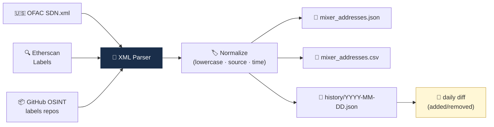

# Project 03 — Mixer 주소 공개소스 Fetcher

> 위험 wallet 데이터셋을 공개 소스에서 자동 수집. (D42 미니 프로젝트)

## 🏗 아키텍처



## 왜 이걸 만드나

"KYT 벤더의 진짜 경쟁력은 라벨 DB"라는 말을 **직접 체감**하는 프로젝트. OFAC SDN XML을 파싱하고 Etherscan 라벨을 긁어서 자체 mixer 데이터셋을 만들어보면, 왜 이 작업이 수년간의 축적이 필요한지, 그리고 Chainalysis가 10억+ 주소 매핑을 가진 것이 어떤 의미인지 알게 됩니다. Week 6의 **CMLN·mixer·OSINT** 지식이 코드로 응축되는 순간.

## 학습 목표

1. OFAC SDN XML 파싱
2. Etherscan label 데이터 활용
3. 표준 형식으로 저장 (JSON + CSV)
4. 일일 업데이트 + diff 추적

## 사양

### 입력
- 없음 (자동 fetch)

### 출력
- `data/mixer_addresses.json`
- `data/mixer_addresses.csv`
- 매 fetch 시 diff 로그

## 인터페이스

```python
def fetch_ofac_sdn() -> list[dict]:
    """OFAC SDN.xml → 가상자산 주소만 추출"""

def fetch_etherscan_label(label: str) -> list[str]:
    """Etherscan 라벨 페이지 (예: tornado-cash)"""

def normalize(addr: str, source: str, label: str) -> dict:
    return {
        "address": addr.lower(),
        "label": label,
        "source": source,
        "fetched_at": datetime.utcnow().isoformat(),
    }

def save_json(records: list[dict], path: str): ...
def save_csv(records: list[dict], path: str): ...

def diff_with_previous(current: list, prev: list) -> dict:
    """{added: [...], removed: [...]}"""
```

## 데이터 소스

### 1. OFAC SDN
- URL: https://www.treasury.gov/ofac/downloads/sdn.xml
- 가상자산 주소: `<feature><type>Digital Currency Address</type>...` 형태
- 무료, 공개

### 2. Etherscan Label DB
- 페이지 스크래핑 (rate limit 주의)
- 예: `https://etherscan.io/accounts/label/tornado-cash`
- 공개 정보, robots.txt 준수

### 3. (선택) 추가 OSINT
- GitHub 라벨 저장소 (예: `0xVisor/labels`)
- Slowmist / 분석회사 공개 자료

## 산출물

```
03_mixer_fetcher/
├── README.md
├── main.py
├── requirements.txt
├── data/
│   ├── mixer_addresses.json
│   ├── mixer_addresses.csv
│   └── history/
│       └── YYYY-MM-DD.json  # 일별 스냅샷
└── .env.example
```

## 💼 실무 현장 (Industry Reality)

### 실제 회사에서는 이 기능을 어떻게 쓰나

라벨 DB는 AML·KYT 조직의 **심장**입니다. 한국 VASP의 경우 Chainalysis에서 **월 단위로 라벨 피드를 받아 자체 내재화**하고, 여기에 **한국 특수 라벨**(국내 거래소 hot wallet, DAXA 공유 블랙리스트, 한국 사기 사건 연관 주소, 외교부 제재명단 매핑)을 **추가**해 "Chainalysis + 한국 보강" 혼합 DB를 운영합니다. 이 DB가 KYT 엔진·OFAC 스크리너·사기 탐지·STR 작성 모두에 공통 참조되므로, **DB 품질이 탐지 품질 전체를 결정**합니다.

### 프로덕션 아키텍처 비교

| 항목 | 이 프로젝트(학습용) | 한국 VASP 프로덕션 |
|---|---|---|
| 데이터 소스 | OFAC SDN + Etherscan label 스크랩 | Chainalysis Data Feed API + 자체 OSINT + DAXA 공유 |
| 주소 규모 | 수백~수천 | 수천만~수억 주소 (Chainalysis 제공) |
| 업데이트 주기 | 일 1회 cron | Chainalysis는 수시 push + 자체 시간별 refresh |
| 카테고리 | "mixer" 단일 태그 | 수십 개 risk category(mixer · darknet · scam · ransomware · sanctions · gambling · CSAM 등) |
| 신뢰도(confidence) | 출처만 표시 | 각 라벨에 HIGH/MED/LOW 신뢰도 + 근거 링크 |
| 버전 관리 | daily diff | 모든 변경 이력 추적 + AMLO 리뷰 로그 |

### 벤더 대체재

- **Chainalysis Data Feed** — 업계 표준, 10억+ 주소. 한국 VASP 대부분 채택. 연 $100K~수백만 구간
- **Elliptic Data** — 영국·EU 법집행 강세
- **TRM Address Intelligence** — 미국 정부·제재 특화
- **Merkle Science** — 동남아·인도·MENA 강세, 상대적 저렴
- **Arkham Intelligence** — 무료 + 크라우드 라벨, 품질은 낮으나 보완용
- **오픈소스**: Blockchair labels, 0xVisor/labels GitHub, Etherscan 공개 라벨 — 커버리지 부족하나 학습 보완용

### 운영 KPI·SLA

- **라벨 커버리지**: 직전 분기 KYT 알림 주소 중 라벨 매핑률 ≥ 60~80%
- **라벨 갱신 지연**: OFAC 신규 SDN 등재 → 사내 DB 반영까지 ≤ 1~4시간
- **False label rate**: 오라벨(잘못된 태그)로 인한 고객 불만 → 월 10건 이하 목표
- **커스텀 라벨 품질**: 자체 추가 라벨의 이의제기 → 정정 완료 ≤ 5영업일

### 배포·운영 팁

- **License 경계**: Chainalysis·Elliptic 라벨을 **자사 DB에 통째로 저장하거나 재배포**하면 라이선스 위반. 일반적으로 "시스템 내부 조회용"만 허용되며, **원시 데이터 덤프는 금지**.
- **OFAC 주소 형식 변화**: 2020년부터 OFAC SDN에 가상자산 주소가 포함됐지만 **XML 스키마가 2022·2024 두 차례 변경**. 파서가 `<feature>` 태그 버전별 처리 필요.
- **false positive 방지**: mixer로 태그된 Tornado Cash 풀 주소 + **스마트컨트랙트 자체**를 구분해야 함. 스마트컨트랙트 주소만 태그하고 사용자 입금 라우팅 주소는 별도 취급.
- **DAXA 공유 리스트**: 한국 원화거래소 5사(Upbit·Bithumb·Coinone·Korbit·Gopax)는 **DAXA를 통해 사기·해킹 주소 공유**. 이 피드는 대외비이며 공개 프로젝트로 재현 불가.
- **감사 대비**: "이 주소가 왜 mixer로 태그됐나"를 1년 후에도 답할 수 있도록 **근거 URL + 태그 시점 + 태그 담당자** 세 필드를 필수 보관.

## 학습 자료

- [`../../notes/5-compliance/sanctions-screening.md`](../../notes/5-compliance/sanctions-screening.md) — 제재 스크리닝
- [`../../notes/3-crypto-aml/onchain-typology.md`](../../notes/3-crypto-aml/onchain-typology.md) — Mixer
- [OFAC SDN 다운로드](https://home.treasury.gov/policy-issues/financial-sanctions/specially-designated-nationals-list-data-formats-data-schemas)

## 한계 / 주의

- OFAC SDN은 정기 업데이트 (보통 주 1~2회)
- Etherscan 스크래핑은 약관 준수 필수
- 라벨 정확도는 출처에 따라 변동
- 가상자산 주소가 SDN에 포함되는 형식이 시간에 따라 변할 수 있음

## 보너스 챌린지

- 일일 cron job (GitHub Actions)
- Slack/Discord 알림 (신규 추가 시)
- 한국 외교부 제재명단 추가
- UN Consolidated List 추가 (이름 + 가상자산 매핑)
