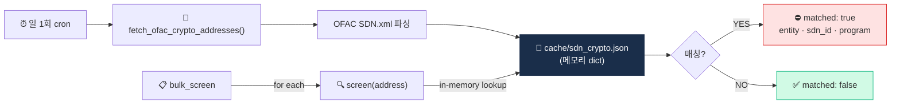

# Project 04 — OFAC SDN Crypto Wallet Screener

> 입력 주소가 OFAC SDN에 매칭되는지 자동 체크. (D49 미니 프로젝트)


> **상태**: 스펙 작성 완료 (README.md만 존재, `main.py` 미작성 — 학습자 구현 대상)
> **위치**: `projects/04-ofac-screener/` (예정: README.md + main.py + test.py + data/)
> **예상 구현 시간**: 주말 1일

## 🏗 아키텍처



## 왜 이걸 만드나

제재 스크리닝이 **왜 시스템 없이는 불가능한지** 체감하는 프로젝트. OFAC SDN은 수시 업데이트되고, SDN.xml 파싱·정규화·O(1) lookup·False Positive 처리 흐름까지 모두 자동화해야 실시간 거래 차단이 가능합니다. Week 7의 **5대 리스트·2차 제재·Binance $4.3B 교훈**이 왜 시스템 투자를 강제하는지 코드로 확인.

## 학습 목표

1. OFAC SDN crypto 주소 캐시 운영
2. 단일 / 벌크 스크리닝 함수
3. 매칭 결과 표준 응답
4. False positive disposition 흐름

## 사양

### 입력
- 가상자산 지갑주소 1개 또는 리스트

### 출력
```json
{
  "address": "0xABC...",
  "matched": true,
  "match_info": {
    "entity_name": "Lazarus Group",
    "sdn_id": "12345",
    "programs": ["DPRK", "CYBER"],
    "listed_date": "2020-08-15"
  }
}
```

## 인터페이스

```python
def fetch_ofac_crypto_addresses() -> dict[str, dict]:
    """OFAC SDN.xml → {address.lower(): metadata}"""

def screen(address: str) -> dict:
    """단일 주소 스크리닝"""

def bulk_screen(addresses: list[str]) -> list[dict]:
    """다수 주소 스크리닝"""

def refresh_cache() -> int:
    """캐시 강제 갱신, 신규 추가 수 반환"""
```

## 캐시 전략

- 최초 fetch → `cache/sdn_crypto.json`
- 일 1회 자동 갱신 (timestamp 기반)
- 메모리 dict로 O(1) lookup

## 테스트 케이스

1. 알려진 SDN 주소 (공개) → matched: true
2. 정상 wallet → matched: false
3. 대소문자 다양 (0xABC vs 0xabc) → matched (정규화)
4. 잘못된 형식 입력 → 에러 핸들링
5. 벌크 100개 → 빠른 응답

## 산출물

```
04_ofac_screener/
├── README.md
├── main.py
├── test.py
├── requirements.txt
├── cache/
│   └── sdn_crypto.json
└── .env.example
```

## 💼 실무 현장 (Industry Reality)

### 실제 회사에서는 이 기능을 어떻게 쓰나

OFAC SDN 스크리닝은 VASP의 **무조건 실패 불가(zero-tolerance)** 통제입니다. Binance($4.3B)·OKX($504M)·Bittrex($30M)·Kraken($30M) 합의금 대부분이 제재 스크리닝 실패에서 촉발됐으므로, 한국 VASP도 **모든 온보딩·모든 입출금·모든 국가 IP**에 대해 실시간 매칭을 돌립니다. 자체 스크리너는 보통 **이름(자연인) + 가상자산 주소** 두 차원으로 분리되고, 이 프로젝트는 후자에 해당.

### 프로덕션 아키텍처 비교

| 항목 | 이 프로젝트(학습용) | 한국 VASP 프로덕션 |
|---|---|---|
| 스크리닝 대상 | 가상자산 주소만 | 이름·생년월일·국적·주소·가상자산 주소 다차원 |
| 매칭 알고리즘 | 정확 일치(exact) | Fuzzy matching(Levenshtein·Soundex·음차 변환·로마자 이형) |
| 리스트 | OFAC SDN만 | OFAC + UN Consolidated + EU + UK HMT + 외교부 + DAXA + 내부 블랙리스트 7~10개 병합 |
| 갱신 주기 | 일 1회 cron | OFAC 직접 구독(즉시) + 벤더 fuzzy 룰 동시 |
| FP 처리 | 없음 | Case Management(Hummingbird·Unit21) → AMLO 리뷰 → Disposition(TP/FP) 로그 |
| 감사 증거 | 없음 | 모든 스크리닝 결과 5~15년 보관, 규제 검사 시 근거 제시 |

### 벤더 대체재

- **LSEG World-Check** — 이름·PEP 스크리닝의 사실상 표준. 은행·보험·VASP 공통. 연 $20K~수백만
- **Dow Jones Risk Center** — World-Check 경쟁자, 언론 adverse media 강세
- **ComplyAdvantage** — 스타트업·핀테크 친화, API 우선, 가격 저렴
- **NICE Actimize WL-X** — 대형 은행용 워치리스트 엔진
- **Chainalysis Sanctions Screening API** — 가상자산 주소 스크리닝 특화, KYT bundle
- **OFAC SCDN 공식 API** — 무료, 기본 매칭만. 보조용

한국 VASP는 보통 **World-Check(이름) + Chainalysis(주소) + 자체 외교부 리스트** 조합으로 3중 운영.

### 운영 KPI·SLA

- **매칭 지연시간**: 단건 p95 < 100ms (거래 블로킹에 영향 주지 않기 위해)
- **FP rate**: 이름 매칭 70~90% FP는 업계 상수. Fuzzy threshold 튜닝으로 완화
- **TP 미탐(miss)**: **0건이 KPI**. 미탐 1건 발생 시 규제 리스크 극대
- **리스트 갱신 지연**: 신규 SDN 등재 → 시스템 반영 ≤ 1~4시간이 내부 표준
- **Disposition SLA**: FP 판정 완료까지 ≤ 24시간

### 배포·운영 팁

- **2차 제재(Secondary sanction) 주의**: OFAC은 **SDN 엔티티와 거래하는 제3자**까지 제재 가능(미국 외 기업 포함). 한국 VASP가 러시아 SDN과 한 단계 건너 연결되면 그 자체로 리스크.
- **Strong hit vs Weak hit 구분**: 이름 완전 일치는 strong hit → 즉시 BLOCK. 로마자 유사만 일치는 weak hit → 생년월일·주소·여권 추가 확인. 한국 흔한 성(김·이·박)은 weak hit가 압도적 다수.
- **주소 대소문자 정규화**: ETH 주소는 EIP-55 체크섬 대소문자 규칙이 있지만 **OFAC 리스트에는 소문자로 등재**되는 경우가 많음. lowercase 비교가 표준.
- **리스트 diff 감시**: 신규 등재뿐 아니라 **해제(delisting)**도 체크. 제재 해제된 고객에 대한 지속 차단은 **고객 민원·소송** 사유가 됨.
- **감사 증거 보관**: 모든 스크리닝 요청·응답을 **immutable log**(WORM 저장)로 보관. AWS S3 Object Lock 또는 WAL 기반 append-only DB가 흔한 선택.

## 학습 자료

- [`../../notes/5-compliance/sanctions-screening.md`](../../notes/5-compliance/sanctions-screening.md)
- [`../../notes/2-regulations/us-bsa-fincen.md`](../../notes/2-regulations/us-bsa-fincen.md) — OFAC
- [OFAC SDN 검색](https://sanctionssearch.ofac.treas.gov/)
- [OFAC 데이터 포맷](https://home.treasury.gov/policy-issues/financial-sanctions/specially-designated-nationals-list-data-formats-data-schemas)

## 한계 / 주의

- 직접 매칭만 (cluster matching 별도)
- 새 SDN 등재 즉시 반영 안 됨 (캐시 갱신 필요)
- 한국 외교부 명단 별도 (추가 보너스)
- **법적 책임 회피**: 이 도구는 학습용, 실제 컴플라이언스 사용 시 별도 검증

## 보너스 챌린지

- Cluster matching (D35 tracer 결합)
- 한국 외교부 + UN + EU consolidated 통합
- Webhook 알림 (매칭 시)
- Disposition 워크플로 (TP/FP 코드 기록)
- API 서버화 (FastAPI)
