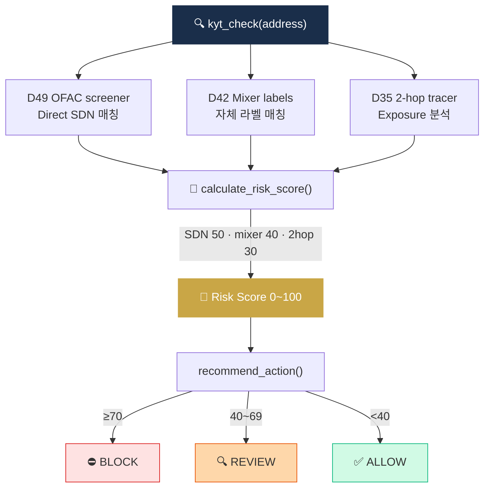

# Project 05 — KYT API 호출 Wrapper

> 자체 또는 외부 KYT를 통합 인터페이스로. (D56 미니 프로젝트)


> **상태**: 스펙 작성 완료 (README.md만 존재, `main.py` 미작성 — 학습자 구현 대상)
> **위치**: `projects/05-kyt-wrapper/` (예정: README.md + main.py + test.py + sample_outputs/)
> **예상 구현 시간**: 주말 2일

## 🏗 아키텍처



## 왜 이걸 만드나

앞서 만든 **D42(mixer)·D49(OFAC)·D35(tracer)** 가 각기 따로 작동하던 것을, 하나의 `kyt_check(address)` 함수로 **통합**하는 프로젝트. Risk Score를 계산하고 ALLOW·REVIEW·BLOCK 중 하나의 action을 추천하는 구조를 만들면, Capstone에서 설계할 Risk Engine의 **핵심 로직**이 이미 구현된 상태로 도착합니다. 6개 프로젝트 중 **가장 통합적이고 실무에 가까운** 산출물.

## 학습 목표

1. KYT API 통합 패턴 익히기
2. Risk Score 계산 (자체 또는 벤더 결과 종합)
3. Action 추천 (ALLOW / REVIEW / BLOCK)
4. 이전 프로젝트 (D42 mixer + D49 OFAC + D35 tracer) 결합

## 사양

### 입력
- 가상자산 지갑주소 1개

### 출력
```json
{
  "address": "0xABC...",
  "risk_score": 75,
  "risk_categories": ["mixer_exposure", "sanctions_2hop"],
  "exposure": {
    "direct": [
      {"address": "0xTornado...", "label": "tornado-cash", "tx_count": 3}
    ],
    "indirect_2hop": [
      {"address": "0xSDN...", "label": "OFAC SDN: Lazarus", "via": "0xMid..."}
    ]
  },
  "recommended_action": "BLOCK",
  "checked_at": "2026-04-17T10:00:00Z"
}
```

## 인터페이스

```python
def kyt_check(address: str) -> dict:
    """통합 KYT 체크"""
    # 1. OFAC 매칭 (D49)
    sdn = ofac_screener.screen(address)
    
    # 2. 자체 라벨 매칭 (D42 mixer 등)
    labels = local_label_match(address)
    
    # 3. Exposure 분석 (D35 trace)
    trace = onchain_tracer.trace_two_hop(address)
    
    # 4. Risk Score 계산
    score = calculate_risk_score(sdn, labels, trace)
    
    # 5. Action 추천
    action = recommend_action(score)
    
    return { ... }

def calculate_risk_score(sdn, labels, trace) -> int:
    """0~100 점수"""
    # Direct SDN: +50
    # Direct mixer: +40
    # 2-hop SDN: +30
    # 2-hop mixer: +20

def recommend_action(score: int) -> str:
    if score >= 70: return "BLOCK"
    if score >= 40: return "REVIEW"
    return "ALLOW"
```

## 옵션 — 외부 API

학습용 무료/저비용:
- **Bitquery** (GraphQL, 무료 티어) — https://bitquery.io
- **AMLBot** — 일부 무료
- **Etherscan + 자체 라벨** — 가장 단순

## 테스트 케이스

1. 정상 wallet → ALLOW
2. Tornado 직접 노출 → BLOCK
3. 2-hop OFAC SDN 노출 → REVIEW or BLOCK
4. 라벨 없는 신규 wallet → ALLOW (보수적)
5. 한국 거래소 hot wallet → ALLOW + 라벨 표기

## 산출물

```
05_kyt_wrapper/
├── README.md
├── main.py
├── test.py
├── requirements.txt
├── sample_results/
│   ├── normal_wallet.json
│   ├── mixer_exposed.json
│   └── sdn_2hop.json
└── .env.example
```

## 💼 실무 현장 (Industry Reality)

### 실제 회사에서는 이 기능을 어떻게 쓰나

KYT wrapper는 한국 VASP의 **AML 파이프라인 핵심 레이어**입니다. 거래 하나가 발생하면 Kafka 이벤트로 흘러 들어와 wrapper가 Chainalysis KYT · 자체 라벨 DB · OFAC 스크리너 결과를 **한 번에 합쳐** Risk Score · Action을 내려주고, 이 응답이 거래 엔진(trading engine)·출금 엔진·Case Management 세 곳에 동시 배포됩니다. 한국 Upbit·Bithumb이 **Chainalysis KYT를 직접 사용하지 않고 wrapper layer를 중간에 두는 이유**는 (1) 벤더 응답을 사내 스키마로 정규화 (2) 한국 특수 라벨·룰을 overlay (3) 벤더 장애 시 fallback 경로 — 이 세 가지.

### 프로덕션 아키텍처 비교

| 항목 | 이 프로젝트(학습용) | 한국 VASP 프로덕션 |
|---|---|---|
| 호출 방식 | 동기 함수 | Kafka → Flink → Chainalysis API → 결과 이벤트 → Kafka topic |
| 처리량 | 단건 동기 | 초당 수백~수천 건 streaming |
| Risk Score | 고정 가중치 룰 | ML(XGBoost) + 룰 앙상블 + 벤더 score 혼합 |
| 출력 소비처 | 결과 JSON 단일 | trading · 출금 · STR 후보 · Case Mgmt · BI 5개 downstream |
| 장애 대응 | 없음 | 벤더 장애 시 자체 라벨 DB로 degraded mode + alert |
| 성능 요구 | 없음 | p95 200ms 이하 (거래 블로킹 SLA) |

### 벤더 대체재

- **Chainalysis KYT** — 업계 표준. REST API + webhook alert. 한국 Upbit·Bithumb 실사용. 연 $50K~$수백만
- **Elliptic Navigator / Lens** — UI 우수, EU 법집행 강세
- **TRM Labs KYT** — 미국 정부 계약 급성장, API 응답 빠름
- **Merkle Science Compass** — 동남아 강세, 상대적 저렴
- **Crystal Intelligence KYT** — 러시아·CIS 특화
- **Nominis · AnChain.AI** — 신규 진입, 특정 영역 특화

보통 **1 primary(Chainalysis) + 1 backup(TRM 또는 Elliptic)** 이중 구축이 대형 VASP 표준.

### 운영 KPI·SLA

- **응답 지연**: p95 < 200ms (거래 블로킹 한도)
- **가용성(uptime)**: 99.95% 이상 (벤더 SLA + wrapper fallback)
- **FP rate**: 70~90% (KYT Alert 중 실제 STR로 이어지는 비율 1~5%)
- **FN(미탐) rate**: 측정 어려움. 사후 STR·사건 피드백으로 역추적
- **일일 Alert 볼륨**: 소형 VASP 수십 건 / 중형 수백 건 / 대형(Coinbase 급) 수만 건
- **비용 per 1M screenings**: Chainalysis 기준 약 $5K~$20K (계약 규모별)

### 배포·운영 팁

- **웹훅 vs 폴링**: Chainalysis KYT는 webhook(push) 권장. 폴링은 rate limit·지연 문제로 실무 지양. webhook 수신 endpoint는 **멱등성(idempotent)** 보장 필수 — 동일 alert id 중복 수신 대비.
- **Risk Score 가중치 튜닝**: 초기에는 벤더 default 그대로 사용 → 3개월 FP/TP 분석 후 **룰 위원회(월 1회)**에서 가중치 조정. 한 번에 다 바꾸지 않고 1~2개 룰씩 A/B 테스트.
- **Exposure 정의 합의**: "direct" vs "indirect(2-hop)" vs "far(3-6 hop)" 경계가 벤더마다 다름. Chainalysis는 `direct/indirect`, TRM은 `exposure category`. 사내 스키마 정규화 안 하면 분석가 혼란.
- **벤더 장애 대응**: Chainalysis API 다운 시 **거래를 전부 BLOCK할지, 자체 라벨만으로 ALLOW할지** 사전 정책 결정. 업계 관행은 "고위험 거래(>$10K)만 BLOCK, 소액은 제한적 ALLOW + 사후 재검증".
- **STR 연계**: wrapper가 Risk Score ≥ 70 판정 시 **자동으로 Case Management에 티켓 생성 + STR 후보 큐 등록**. 분석가가 승인 → AMLO 서명 → FIU-TIS 제출. 이 체인이 wrapper 설계의 최종 목적.

## 학습 자료

- [`../../notes/4-technology/kyc-kyt.md`](../../notes/4-technology/kyc-kyt.md) — KYT
- [`../../notes/4-technology/blockchain-analytics.md`](../../notes/4-technology/blockchain-analytics.md) — Exposure
- [`../../notes/7-vendors/analytics-vendors.md`](../../notes/7-vendors/analytics-vendors.md) — 벤더 비교

## 한계 / 주의

- **자체 KYT는 글로벌 attribution 절대 부족**
- 프로덕션 = Chainalysis/TRM/Elliptic + 자체 보완 하이브리드
- Risk Score 가중치는 회사/규제마다 다름 (튜닝 필수)
- False positive 처리 워크플로 필수

## 보너스 챌린지

- 결과를 STR 후보 큐에 자동 추가
- 일일 알람 보고서
- 다중 체인 통합 (BTC + ETH + Tron)
- Webhook 알림
- 분석 대시보드 (Streamlit)
