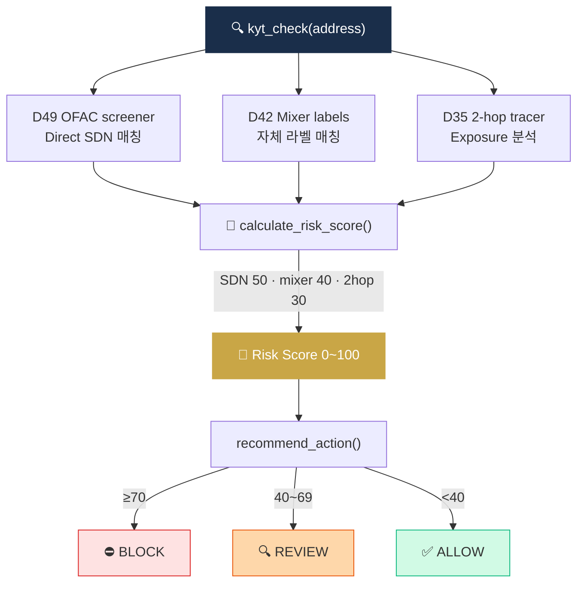

# Project 05 — KYT API 호출 Wrapper

> 자체 또는 외부 KYT를 통합 인터페이스로. (D56 미니 프로젝트)

## 🏗 아키텍처



## 왜 이걸 만드나

앞서 만든 **D42(mixer)·D49(OFAC)·D35(tracer)** 가 각기 따로 작동하던 것을, 하나의 `kyt_check(address)` 함수로 **통합**하는 프로젝트. Risk Score를 계산하고 ALLOW·REVIEW·BLOCK 중 하나의 action을 추천하는 구조를 만들면, Capstone에서 설계할 Risk Engine의 **핵심 로직**이 이미 구현된 상태로 도착합니다. 6개 프로젝트 중 **가장 통합적이고 실무에 가까운** 산출물.

## 학습 목표

1. KYT API 통합 패턴 익히기
2. Risk Score 계산 (자체 또는 벤더 결과 종합)
3. Action 추천 (ALLOW / REVIEW / BLOCK)
4. 이전 프로젝트 (D42 mixer + D49 OFAC + D35 tracer) 결합

## 사양

### 입력
- 가상자산 지갑주소 1개

### 출력
```json
{
  "address": "0xABC...",
  "risk_score": 75,
  "risk_categories": ["mixer_exposure", "sanctions_2hop"],
  "exposure": {
    "direct": [
      {"address": "0xTornado...", "label": "tornado-cash", "tx_count": 3}
    ],
    "indirect_2hop": [
      {"address": "0xSDN...", "label": "OFAC SDN: Lazarus", "via": "0xMid..."}
    ]
  },
  "recommended_action": "BLOCK",
  "checked_at": "2026-04-17T10:00:00Z"
}
```

## 인터페이스

```python
def kyt_check(address: str) -> dict:
    """통합 KYT 체크"""
    # 1. OFAC 매칭 (D49)
    sdn = ofac_screener.screen(address)
    
    # 2. 자체 라벨 매칭 (D42 mixer 등)
    labels = local_label_match(address)
    
    # 3. Exposure 분석 (D35 trace)
    trace = onchain_tracer.trace_two_hop(address)
    
    # 4. Risk Score 계산
    score = calculate_risk_score(sdn, labels, trace)
    
    # 5. Action 추천
    action = recommend_action(score)
    
    return { ... }

def calculate_risk_score(sdn, labels, trace) -> int:
    """0~100 점수"""
    # Direct SDN: +50
    # Direct mixer: +40
    # 2-hop SDN: +30
    # 2-hop mixer: +20

def recommend_action(score: int) -> str:
    if score >= 70: return "BLOCK"
    if score >= 40: return "REVIEW"
    return "ALLOW"
```

## 옵션 — 외부 API

학습용 무료/저비용:
- **Bitquery** (GraphQL, 무료 티어) — https://bitquery.io
- **AMLBot** — 일부 무료
- **Etherscan + 자체 라벨** — 가장 단순

## 테스트 케이스

1. 정상 wallet → ALLOW
2. Tornado 직접 노출 → BLOCK
3. 2-hop OFAC SDN 노출 → REVIEW or BLOCK
4. 라벨 없는 신규 wallet → ALLOW (보수적)
5. 한국 거래소 hot wallet → ALLOW + 라벨 표기

## 산출물

```
05_kyt_wrapper/
├── README.md
├── main.py
├── test.py
├── requirements.txt
├── sample_results/
│   ├── normal_wallet.json
│   ├── mixer_exposed.json
│   └── sdn_2hop.json
└── .env.example
```

## 학습 자료

- [`../../notes/4-technology/kyc-kyt.md`](../../notes/4-technology/kyc-kyt.md) — KYT
- [`../../notes/4-technology/blockchain-analytics.md`](../../notes/4-technology/blockchain-analytics.md) — Exposure
- [`../../notes/7-vendors/analytics-vendors.md`](../../notes/7-vendors/analytics-vendors.md) — 벤더 비교

## 한계 / 주의

- **자체 KYT는 글로벌 attribution 절대 부족**
- 프로덕션 = Chainalysis/TRM/Elliptic + 자체 보완 하이브리드
- Risk Score 가중치는 회사/규제마다 다름 (튜닝 필수)
- False positive 처리 워크플로 필수

## 보너스 챌린지

- 결과를 STR 후보 큐에 자동 추가
- 일일 알람 보고서
- 다중 체인 통합 (BTC + ETH + Tron)
- Webhook 알림
- 분석 대시보드 (Streamlit)
