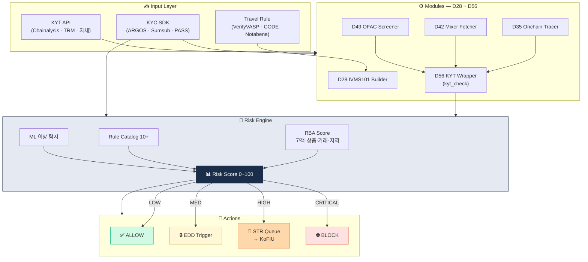

# Capstone — Mini AML Risk Engine 설계서

> 60일 학습 통합. 가상자산 거래소·수탁용 통합 위험엔진의 1차 설계 문서. (D59 캡스톤)

> ⚠️ 이 파일은 **템플릿** 입니다. D59 캡스톤 작업 시 본인이 직접 채워서 완성하세요.

## 🏗 Capstone 통합 아키텍처



## 캡스톤의 목적

60일 동안 배운 **9 의무·RBA·KYT·Travel Rule·제재·STR·거버넌스** 를 하나의 시스템 설계서로 묶는 작업. 단순히 기능을 나열하는 게 아니라, **한국 규제(특금법 §·이용자보호법 §) → 시스템 모듈 → 운영 절차**가 추적 가능하도록 연결합니다. 이 문서가 완성되면 실제 VASP 설립 시점에 **법무팀·컴플팀·엔지니어팀이 공통 참조할 수 있는 1차 설계서**가 됩니다.

## 왜 이게 중요한가

글로벌 VASP의 AML 사고 대부분은 "각 조각은 있는데 통합이 없다"에서 출발합니다. KYC는 A팀, KYT는 B팀, Travel Rule은 C팀이 각자 별도로 운영하면 고객 위험이 **전체적으로 합산되지 않습니다**. Capstone은 이 통합을 **문서 레벨**에서라도 먼저 만들어보는 훈련. 추후 90일 로드맵(D60)에서 이 설계서가 실제 프로토타입으로 발전할 수 있습니다.

---

# Mini AML Risk Engine — Design Document

## 1. 문제 정의
<!-- 풀려는 문제 / 사업유형 / 성공 기준 -->

### 시나리오
> 예: "한국 가상자산 거래소가 기관 고객 신규 온보딩 시, KYC + KYT를 통합한 자동 위험평가 시스템 필요"

### 사업유형
- [ ] 거래소
- [ ] 수탁업
- [ ] OTC desk
- [ ] 결제 PG
- [ ] 솔루션 제공사

### 성공 기준
- 정확도 (true positive rate ≥ X%)
- 속도 (응답 ≤ X초)
- False positive ≤ X%

---

## 2. 적용 규제 매핑

### 한국
| 의무 | 법령 § | 시스템 어디서 충족 |
|---|---|---|
| 신원확인 | 특금법 §5의2 | KYC 모듈 |
| 실소유자 | 특금법 §5의2 | KYC 모듈 |
| EDD | 특금법 §5의2 + 가이드 | Risk Engine |
| Travel Rule | 특금법 §5의2 + 시행령 §10의10 | Travel Rule SDK |
| STR | 특금법 §4 | STR 큐 |
| 자산 분리 | 이용자보호법 §10 | (별도, 위탁 시스템) |
| 시세조종 | 이용자보호법 §10~19 | (별도, Market Surveillance) |
| 기록보관 | 이용자보호법 §11 | DB 15년 정책 |

### 글로벌 (해외 영업 시)
- FATF R.15, R.16
- US OFAC SDN
- (해당 시) EU TFR, AMLR

---

## 3. 데이터 소스

| 영역 | 1순위 | 2순위 |
|---|---|---|
| **본인확인** | PASS / NICE / KCB / 카카오 | — |
| **KYC SDK** | ARGOS / ICONLOOP / Sumsub | — |
| **PEP / Sanctions** | World-Check / ComplyAdvantage | 한국 외교부 자체 |
| **Adverse Media** | RDC / ComplyAdvantage | — |
| **KYT (Blockchain)** | Chainalysis / TRM / Elliptic | 자체 한국 라벨 |
| **OFAC SDN Crypto** | OFAC 직접 + 벤더 | — |
| **Travel Rule** | VerifyVASP / CODE / Notabene | — |
| **국가 위험** | FATF / 외교부 / Basel | — |

---

## 4. 시스템 아키텍처

```
[ User Onboarding ] ────► [ KYC SDK ]
                              │
                              ▼
                       [ Risk Engine ]
                       ├─ KYC Risk
                       ├─ KYT Exposure
                       ├─ Sanctions Match
                       ├─ Behavior Pattern
                       └─ → Risk Score
                              │
              ┌───────────────┼───────────────┐
              ▼               ▼               ▼
          [ ALLOW ]      [ REVIEW ]      [ BLOCK ]
                          │   │
                          │   └─► [ Manual Queue → AMLO ]
                          └─► [ STR 후보 큐 ]
                                    │
                                    └─► [ KoFIU 보고 ]

[ Transaction ] ───► [ KYT real-time ]
                          ├─ Address Screening
                          ├─ Exposure Score
                          ├─ Travel Rule (≥100만원)
                          └─ Sanctions Check
                              │
                              ▼
                          [ Decision ]
```

---

## 5. Risk Score 모델

### 입력 변수
| 변수 | 가중치 | 출처 |
|---|---|---|
| KYC 위험 (PEP, 고위험국) | 30 | KYC + DB |
| KYT 직접 노출 (mixer/SDN) | 40 | KYT API |
| KYT 2-hop 노출 | 20 | KYT API |
| 거래 패턴 (smurfing 등) | 10 | 자체 룰 |

### 등급 매핑
- 0~30: LOW (자동 ALLOW)
- 31~70: MEDIUM (REVIEW)
- 71~100: HIGH (BLOCK + STR)

---

## 6. 룰 카탈로그 (최소 10개)

| ID | 트리거 | Action |
|---|---|---|
| R001 | OFAC SDN 직접 매칭 | BLOCK + STR |
| R002 | Tornado Cash 노출 (1-hop) | BLOCK + STR |
| R003 | 알려진 mixer 노출 (1-hop) | REVIEW |
| R004 | OFAC SDN 2-hop | REVIEW |
| R005 | Smurfing 패턴 (10회+ in 24h) | REVIEW |
| R006 | Pass-through (입금 → 5분 내 전액 출금) | REVIEW |
| R007 | PEP 신규 가입 | EDD trigger |
| R008 | 고위험국 거주 | EDD trigger |
| R009 | 신고 직업 vs 거래 금액 30배+ 불일치 | REVIEW |
| R010 | 비정상 시간대 (UTC 03~05) 대량 거래 | REVIEW |

---

## 7. 운영 플로우

(생략 — 본인이 채움)

---

## 8. 거버넌스

### 5 Pillars 매핑
- 정책: AML 매뉴얼 + 룰 카탈로그
- AMLO: ___ (임원 직책)
- 교육: ___
- 감사: 내부감사 연 1회 + 외부 ___
- CDD/BO: KYC SDK + 25% BO 룰

### 3LoD
- 1선: 영업/CS
- 2선: 컴플라이언스 (Risk Engine 운영)
- 3선: 내부감사

---

## 9. 단계적 도입 로드맵

| 단계 | 기간 | 산출물 |
|---|---|---|
| MVP | 3개월 | KYC + 기본 KYT + Sanctions |
| v1 | 6개월 | + 룰 엔진 + STR 자동화 |
| v2 | 12개월 | + ML 보조 + Cross-chain + Travel Rule 풀스택 |

---

## 10. 리스크와 한계

- False positive: ___% 예상, 운영 비용
- 자체 KYT 한계: 글로벌 attribution은 벤더 의존
- DeFi / Privacy coin 영역은 별도 정책 필요
- 인력: AMLO 1명 + 분석가 ___명

---

## 11. 참고 (60일 학습 자료 인용)

- [`../../notes/1-foundations/`](../../notes/1-foundations/) — AML 기초
- [`../../notes/2-regulations/korea-fiu-act.md`](../../notes/2-regulations/korea-fiu-act.md) — 특금법
- [`../../notes/2-regulations/korea-user-protection.md`](../../notes/2-regulations/korea-user-protection.md) — 이용자보호법
- [`../../notes/3-crypto-aml/travel-rule.md`](../../notes/3-crypto-aml/travel-rule.md) — Travel Rule
- [`../../notes/4-technology/kyc-kyt.md`](../../notes/4-technology/kyc-kyt.md) — KYC/KYT
- [`../../notes/5-compliance/`](../../notes/5-compliance/) — 컴플 운영
- [`../../notes/7-vendors/`](../../notes/7-vendors/) — 솔루션 벤더
- [`../../notes/6-cases/`](../../notes/6-cases/) — 사례
- [`../../deep/`](../../deep/) — 학술/리서치
- [`../01-ivms101-builder/`](../01-ivms101-builder/) — Travel Rule 빌더
- [`../02-onchain-tracer/`](../02-onchain-tracer/) — Onchain trace
- [`../03-mixer-fetcher/`](../03-mixer-fetcher/) — Mixer DB
- [`../04-ofac-screener/`](../04-ofac-screener/) — OFAC 스크리너
- [`../05-kyt-wrapper/`](../05-kyt-wrapper/) — KYT wrapper

---

## 작성자 메모

캡스톤 후 [`../../curriculum/day_60.md`](../../curriculum/day_60.md) 의 90일 트랙 선택 → 이 설계서를 실제 프로토타입으로 발전.
